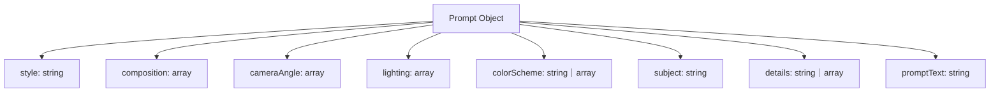

# 图片类提示词 JSON Schema 设计方案

## 1. 提取枚举值
- 从 [`data/提示词优化.md`](data/提示词优化.md:1) 中读取  
  - composition 枚举  
  - cameraAngle 枚举  
  - lighting 枚举  

## 2. 字段类型定义
- style：单个字符串  
- composition：字符串数组，枚举前述 composition 列表  
- cameraAngle：字符串数组，枚举前述 cameraAngle 列表  
- lighting：字符串数组，枚举前述 lighting 列表  
- colorScheme：支持字符串或字符串数组  
- subject：字符串  
- details：支持字符串或字符串数组  
- promptText：字符串  

## 3. JSON Schema 结构
顶层 `type: object`  
- `properties` 中为每个字段定义 `type`、`enum`、`oneOf` 等  
- `required`：style、composition、cameraAngle、lighting、subject、promptText  

## 4. Mermaid 图示

## 5. 下一步
切换到代码模式以实现 JSON Schema 并提供示例 JSON 对象。